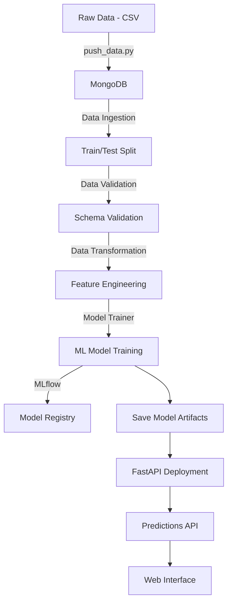

# Network Security Project - ML

A comprehensive machine learning project for network security threat detection and classification. This end-to-end ML pipeline includes data ingestion from MongoDB, data validation and transformation, model training with MLflow tracking, and deployment via FastAPI.

## 📋 Table of Contents

- [Overview](#overview)
- [Features](#features)
- [Project Structure](#project-structure)
- [Installation](#installation)
- [Configuration](#configuration)
- [Usage](#usage)
- [API Endpoints](#api-endpoints)
- [Pipeline Components](#pipeline-components)
- [Technologies Used](#technologies-used)
- [Author](#author)

## 🎯 Overview

This project implements a machine learning solution for detecting network security threats using phishing data. It follows a modular architecture with separate components for data ingestion, validation, transformation, and model training. The trained model is deployed as a REST API using FastAPI for real-time predictions.

## ✨ Features

- **End-to-End ML Pipeline**: Complete workflow from data ingestion to model deployment
- **MongoDB Integration**: Seamless data storage and retrieval from MongoDB Atlas
- **Data Validation**: Automated data quality checks and schema validation
- **MLflow Tracking**: Experiment tracking and model versioning with MLflow
- **FastAPI Deployment**: RESTful API for model predictions
- **Batch Prediction**: Support for bulk predictions via CSV upload
- **Modular Architecture**: Clean, maintainable code with separated concerns
- **Custom Exception Handling**: Comprehensive error handling and logging
- **Web Interface**: HTML templates for prediction visualization

## 📁 Project Structure

```
network_security_project/
│
├── networksecurity/              # Main package directory
│   ├── components/               # Pipeline components
│   │   ├── data_ingestion.py    # Data ingestion from MongoDB
│   │   ├── data_validation.py   # Data validation and quality checks
│   │   ├── data_transformation.py # Feature engineering and preprocessing
│   │   └── model_trainer.py     # Model training and evaluation
│   │
│   ├── pipeline/                 # Pipeline orchestration
│   │   ├── training_pipeline.py # Complete training pipeline
│   │   └── batch_prediction.py  # Batch prediction pipeline
│   │
│   ├── entity/                   # Data classes
│   │   ├── config_entity.py     # Configuration entities
│   │   └── artifact_entity.py   # Artifact entities
│   │
│   ├── constant/                 # Constants and configurations
│   │   └── __init__.py          # Training pipeline constants
│   │
│   ├── utils/                    # Utility functions
│   │   ├── main_utils/          # General utilities
│   │   └── ml_utils/            # ML-specific utilities
│   │
│   ├── exceptions/               # Custom exception handling
│   │   └── exception.py         # NetworkSecurityException class
│   │
│   ├── logging/                  # Logging configuration
│   │   └── logger.py            # Custom logger setup
│   │
│   └── cloud/                    # Cloud integrations (S3, etc.)
│
├── final_model/                  # Saved model artifacts
│   ├── model.pkl                # Trained model
│   └── preprocessor.pkl         # Data preprocessor
│
├── templates/                    # HTML templates for web UI
│   └── table.html               # Prediction results table
│
├── Network_data/                 # Raw data directory
│   └── phisingData.csv          # Training dataset
│
├── data_schema/                  # Data schema definitions
│
├── notebooks/                    # Jupyter notebooks for exploration
│
├── app.py                        # FastAPI application
├── main.py                       # Pipeline execution script
├── push_data.py                  # MongoDB data upload utility
├── setup.py                      # Package setup configuration
├── requirements.txt              # Project dependencies
└── .env                          # Environment variables (MongoDB URL)
```

## 🚀 Installation

### Prerequisites

- Python 3.8 or higher
- MongoDB Atlas account (or local MongoDB instance)
- Git

### Setup Steps

1. **Clone the repository**
   ```bash
   git clone https://github.com/Vasunavadiya90/Network_security_Project-ML-.git
   cd network_security_project
   ```

2. **Create a virtual environment**
   ```bash
   python -m venv env
   ```

3. **Activate the virtual environment**
   - Windows:
     ```bash
     env\Scripts\activate
     ```
   - Linux/Mac:
     ```bash
     source env/bin/activate
     ```

4. **Install dependencies**
   ```bash
   pip install -r requirements.txt
   ```

5. **Install the package in development mode**
   ```bash
   pip install -e .
   ```

## ⚙️ Configuration

1. **Create a `.env` file** in the project root directory:
   ```env
   MONGODB_URL_KEY=your_mongodb_connection_string
   MONGO_DB_URL=your_mongodb_connection_string
   ```

2. **MongoDB Setup**:
   - Create a MongoDB Atlas cluster or use a local MongoDB instance
   - Create a database named `VasuAi`
   - Create a collection named `NetworkData`

3. **Upload Data to MongoDB** (optional):
   ```bash
   python push_data.py
   ```

## 📖 Usage

### Training the Model

**Option 1: Using main.py**
```bash
python main.py
```

**Option 2: Using the API**
```bash
# Start the FastAPI server
python app.py

# Then make a GET request to:
http://localhost:8000/train
```

### Making Predictions

1. **Start the FastAPI server**:
   ```bash
   python app.py
   ```

2. **Access the API documentation**:
   Navigate to `http://localhost:8000/docs` in your browser

3. **Make predictions**:
   - Upload a CSV file with the same schema as training data
   - POST to `/predict` endpoint
   - View results in an HTML table

## 🔌 API Endpoints

### `GET /`
- **Description**: Redirects to API documentation
- **Response**: Redirect to `/docs`

### `GET /train`
- **Description**: Triggers the complete training pipeline
- **Response**: Success message upon completion
- **Example**:
  ```bash
  curl http://localhost:8000/train
  ```

### `POST /predict`
- **Description**: Accepts a CSV file and returns predictions
- **Request**: Multipart form data with CSV file
- **Response**: HTML table with predictions
- **Example**:
  ```bash
  curl -X POST "http://localhost:8000/predict" \
       -F "file=@data.csv"
  ```

## 🔧 Pipeline Components

### 1. Data Ingestion
- Fetches data from MongoDB collection
- Splits data into train and test sets
- Saves data as CSV files
- **Output**: `DataIngestionArtifact`

### 2. Data Validation
- Validates data schema and quality
- Checks for missing values and data drift
- Generates validation report
- **Output**: `DataValidationArtifact`

### 3. Data Transformation
- Performs feature engineering
- Handles missing values and outliers
- Scales and encodes features
- Saves preprocessor object
- **Output**: `DataTransformationArtifact`

### 4. Model Trainer
- Trains multiple ML models
- Performs hyperparameter tuning
- Evaluates model performance
- Tracks experiments with MLflow
- Saves best model
- **Output**: `ModelTrainerArtifact`

## 🛠️ Technologies Used

- **Python 3.8+**: Core programming language
- **FastAPI**: Web framework for API development
- **Uvicorn**: ASGI server for FastAPI
- **Scikit-learn**: Machine learning library
- **Pandas**: Data manipulation and analysis
- **NumPy**: Numerical computing
- **PyMongo**: MongoDB driver for Python
- **MLflow**: Experiment tracking and model registry
- **DagShub**: MLflow hosting and collaboration
- **Jinja2**: Template engine for HTML rendering
- **Python-dotenv**: Environment variable management
- **Dill**: Object serialization
- **Certifi**: SSL certificate verification

## 👤 Author

**Vasu Navadiya**
- Email: vasunavadiya21@gmail.com
- GitHub: [@Vasunavadiya90](https://github.com/Vasunavadiya90)

## 📝 License

This project is open source and available under the [MIT License](LICENSE).

## 🤝 Contributing

Contributions, issues, and feature requests are welcome! Feel free to check the [issues page](https://github.com/Vasunavadiya90/Network_security_Project-ML-/issues).

## 📊 Project Workflow



## 🎯 Future Enhancements

- [ ] Add more machine learning algorithms
- [ ] Implement real-time monitoring and alerting
- [ ] Add Docker support for containerization
- [ ] Implement CI/CD pipeline
- [ ] Add comprehensive unit tests
- [ ] Deploy to cloud platforms (AWS, Azure, GCP)
- [ ] Add authentication and authorization
- [ ] Implement A/B testing for models
- [ ] Add model performance monitoring dashboard

---

⭐ **If you find this project useful, please consider giving it a star!** ⭐